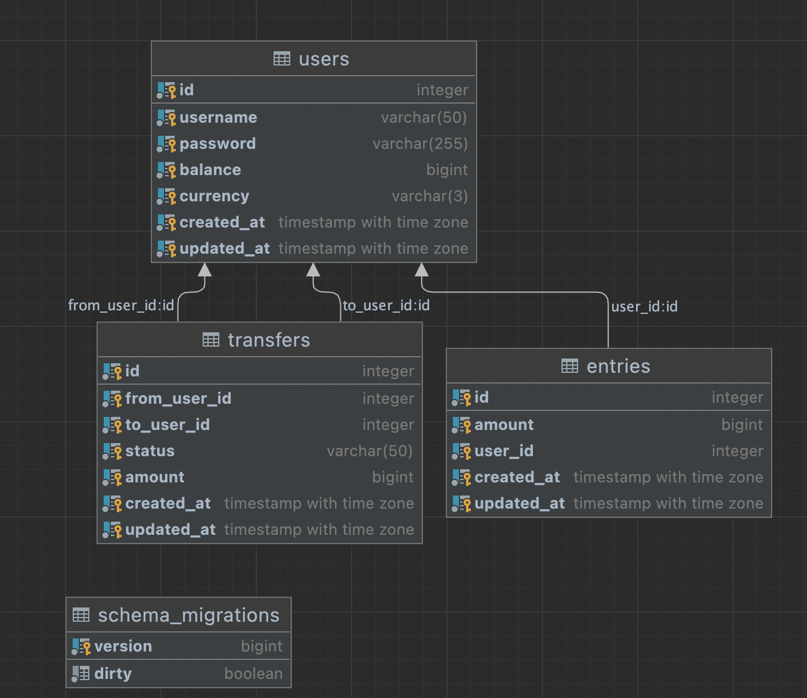

# golang_20210228
Golang Sample project
> Sample transfer money project

### Requirements
------
* User accesses the service through an authenticated HTTP-based API.
(user registration, login not required, provisioned user/credentials through SQL script are fine)
* User should be able to send money to other users
* User should be able to retrieve their balance, and transactions
* Usually MobileWallet2020 stores their data on relational Database, but other means of
storage are fine
* Give some thought as to how the application would be monitored, instrumentation etc,
considering that it would be expected to provide logging downstream to an external
platform such as Prometheus (To be discussed during the interview)
* Please state any assumptions that you make
You have the luxury of proposing (not implementing) one killer feature in your app, to impress the management of the company.

### Features
* [x] User can login
* [x] User can register
* [x] Only Authenticated user can access transfer, user information
* [x] User `A` send money to User `B`
* [x] User can see a users transaction history
* [x] Github CI Action
* [x] Maintain database schema
* [x] model base Unit test
* [x] Documentation
* [x] API base unit test
* [ ] Stress test
* [ ] Logging System
* [ ] Monitoring System
* [ ] Deployment

### Database Diagram

### API Documentation
------
[go to API documentation](./docs/docs.md)

### Development
------
* git clone project
* run command `docker-compose up` or `docker-compose up -d`

### HOW TO TEST
* unit test -> go to src folder and run `make test`

### HOW TO MIGRATE
* In docker -> `docker-compose build migrate` -> `docker-compose start migrate`
* In terminal -> go to src folder and `make migrateup`

### TODO
* Fixing take longer in unit test
* Configure Logging system
* Configure Monitoring System
* Deployment
* Set Load test
* Support multiple currency by user

### Tech Stacks
------
* Golang
* go-migrate
* Postgres
* docker
* docker-compose
* sqlc
* gin
### References

* [go-migrate](https://github.com/golang-migrate/migrate)
* [sqlc](https://sqlc.dev)
* [gin](https://gin-gonic.com)
* [go-swagger](https://goswagger.io/)